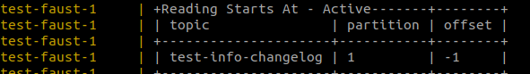
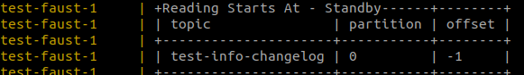

# Test example with several faust clients

## Docker services

- 3 fausts clients. Each of them have 3 shard partitions since the  `TOPIC_PARTITIONS` is set to 3. The app is very basic, there is only one agent in charge of writing in a single table.
- 1 Redpanda broker
- 1 Redpanda console

Run everything :
```bash
docker compose up
```

Check all the Containers have created :

```bash
docker ps --format "table {{.ID}}\t{{.Names}}"
```

>CONTAINER ID   NAMES  
60a14dd448bc  | test-faust-3  
bd4f844fc33c  | test-faust-2  
0a2e4ce1a29a  | test-faust-1  

--- 
## Populate table with 4 elements : 

```bash
docker compose exec faust curl -X POST localhost:6066/info -H 'Content-Type: application/json' -d '{"key":"A", "value":"sail"}'
docker compose exec faust curl -X POST localhost:6066/info -H 'Content-Type: application/json' -d '{"key":"B", "value":"climb"}'
docker compose exec faust curl -X POST localhost:6066/info -H 'Content-Type: application/json' -d '{"key":"C", "value":"ski"}'
docker compose exec faust curl -X POST localhost:6066/info -H 'Content-Type: application/json' -d '{"key":"D", "value":"swim"}'
```

We can check it on the [redpanda console](http://localhost:8080/topics/test-info-changelog?o=-1&p=-1&q&s=50#messages) :


---

At this point everything seems to be normal, for instance, the element `D`  lays on partition 0.


## Test routing (**the bug**) : 

Let us test the decorator `@app.table_route` of our route `/info/{key}/` :

```bash
docker compose exec faust curl localhost:6066/info/D/
```

> "error":"Cannot find this symbol among [dict_keys(['A', 'B', 'C'])]"

It is not the expected behaviour.

## Some weird things

The container `test-faust-1` actively holds the partition 1 and the partition 0 is in stand-by :





According to the faust router app, `D` is on `test-faust-1` (container id: 0a2e4ce1a29a) which is ot true:

```bash
docker compose exec faust curl localhost:6066/router/info/D/
``` 
>http://0a2e4ce1a29a:6066


## Conclusion

The Faust routing follows the standby partition rather than the active one.


