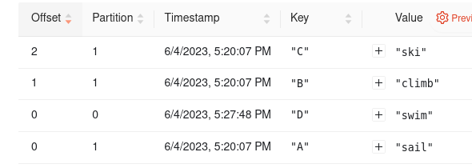

# Test example with several faust clients

## Docker services

- 3 fausts clients. Each of them have 3 shard partitions since the  `TOPIC_PARTITIONS` is set to 3. The app is very basic, there is only one agent in charge of writing in a single table.
- 1 Redpanda broker
- 1 Redpanda console

Run everything
```bash
docker compose up
```

## Populate table with 4 elements : 

```bash
docker compose exec faust curl -X POST localhost:6066/info -H 'Content-Type: application/json' -d '{"key":"A", "value":"sail"}'
docker compose exec faust curl -X POST localhost:6066/info -H 'Content-Type: application/json' -d '{"key":"B", "value":"climb"}'
docker compose exec faust curl -X POST localhost:6066/info -H 'Content-Type: application/json' -d '{"key":"C", "value":"ski"}'
docker compose exec faust curl -X POST localhost:6066/info -H 'Content-Type: application/json' -d '{"key":"D", "value":"swim"}'
```

## Observe it




```bash
docker ps --format "table {{.ID}}\t{{.Names}}"
```

>CONTAINER ID   NAMES  
60a14dd448bc  | test-faust-3  
bd4f844fc33c  | test-faust-2  
0a2e4ce1a29a  | test-faust-1  

At this point everything is normal, `D` element for instance lays on partition 0, managed by `test-faust-1`.


We could verify this by asking to the faust router app :

```bash
docker compose exec faust curl localhost:6066/router/info/D/
``` 
>http://0a2e4ce1a29a:6066

## Test routing (**the bug**) : 

```bash
docker compose exec faust curl localhost:6066/info/D/
```

> "error":"Cannot find this symbol among [dict_keys(['A', 'B', 'C'])]"

## Some weird things

Strangely the logs of :
```bash
docker compose exec faust curl localhost:6066/router/info/
```
>{"http://bd4f844fc33c:6066":{"test-info-changelog":[0]},"http://0a2e4ce1a29a:6066":{"test-info-changelog":[1]},"http://60a14dd448bc:6066":{"test-info-changelog":[2]}

shows clearly that `test-faust-1` (id: 0a2e4ce1a29a)  holds the partition 1 which is not true.


